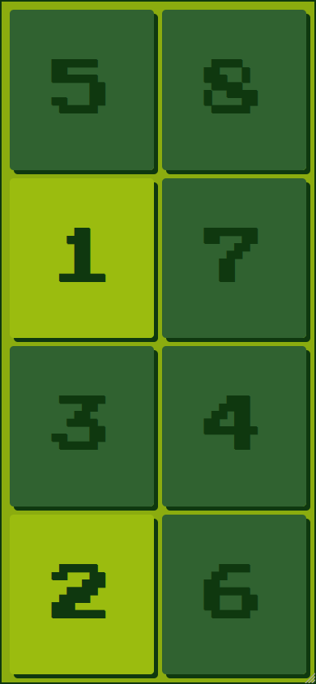

# Number Blocks &middot;   

This is a PWA (progressive web app) mobile game built with React and TypeScript.  It can be installed onto the home screen of a mobile device and played offline.  Great for those long flights when you want to sleep and your kid does not.  The name is totally ripped off from its [TV show namesake](https://www.imdb.com/title/tt7978538/).

The player has to press the numbers in the correct ascending order.  When the next correct number is pressed, it turns green.  When the final number on the screen is pressed, the game resets, shuffling the position of the numbers.  The numbers are shuffled using the [Fisher-Yates shuffle algorithm](https://en.wikipedia.org/wiki/Fisher%E2%80%93Yates_shuffle).  It can be played [here](https://visionary-scone-c0300a.netlify.app/).

It is designed for mobile, and is not optimised for larger screens.  For best results, install it on your home screen.  In iOS, while viewing the game in the Safari browser, tap the Share icon in the menu bar, scroll down the list of options, then tap Add to Home Screen.

## Screenshot

## TODO
- [ ] Add tests
- [x] Make styling look fire
- [ ] Add settings to change:
  - [ ] range of numbers
  - [ ] size of the grid
  - [ ] toggle between letters and numbers
  - [ ] childproof settings: to enter, adult must press digits that they read in words
- [x] Add sound effects